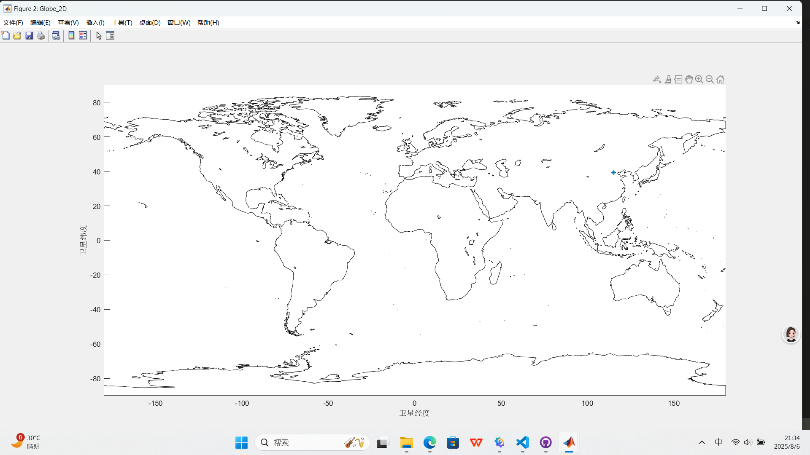

建立地球2D、3D模型，方便后续加卫星轨道。

**earth.m**
```matlab
%% 基本数据

G = 6.67430e-11;    % 万有引力常数
M_earth = 5.972e24; % 单位：千克
M_moon = 7.348e22;  % 单位：千克
R_earth=6371;       %地球半径，单位km

%% 绘制地球模型
Globe_3D=plot_Globe_3D;      %3d模型
Globe_2D=plot_Globe_2D;      %2d模型

figure(Globe_3D);
plot3(-2439,-3367,5826,'*');
figure(Globe_2D);
plot(115.25,39.26,'*');

%% 绘制卫星模型
% 卫星轨道基本信息
initial_params = struct();
initial_params.a = 6878;            % 半长轴，单位为千米
initial_params.e = 0.001;           % 偏心率
initial_params.i = 98;              % 倾角，单位为度
initial_params.Omega = 30;          % 升交点赤经，单位为度
initial_params.w = 120;             % 近地点幅角，单位为度
initial_params.nu = 0;              % 真近点角，单位为度
 
initial_params.velocity = [0, 0, 7.5];   % 初始速度向量，单位为千米/秒
initial_params.position = [0, 0, -initial_params.a];   % 初始位置向量，单位为千米
initial_params.mass = 500;               % 卫星质量，单位为千克
disp(initial_params);               % 打印卫星信息

%
```

**plot_Globe_2D.mlx**

绘制地球2D图形


_2D图像_

```matlab
function Globe_2D=plot_Globe_2D
    % 地理常数
    Globe_2D=figure('Name','Globe_2D'); 
    axis([-180 180 -90 90]) 
    set(gcf,'outerposition', get(0,'screensize')); 
    geoshow('landareas.shp', 'FaceColor', [1 1 1]); 
    grid on 
    hold
    
    grid;
    xlabel('卫星经度');
    ylabel('卫星纬度');
end
```

**plot_Globe_3D.mlx**

绘制地球3D图形


_3D图像_

```matlab
function Globe_3D=plot_Globe_3D
    % 地理常数
    R_earth=6371;%地球半径，单位km
    
    %% 3D 模型
    % 绘制经度线
    Globe_3D=figure('Name','Globe_3D','color','w');
    title('Earth 3D');   %修改图名称
    set(gcf,'outerposition', get(0,'screensize')); 
    hold on
    [x,y,z]=sphere(36);             % 生成一个球，36边，即分辨率：经度10度，纬度5度
    mesh(R_earth.*x,R_earth.*y,R_earth.*z,'EdgeColor',[0.5 0.5 0.5]);    % EdgeColor属性设置网格颜色
    axis equal;
    
    % 绘制海岸线
    load coastlines             % 导入海岸线数据
    x2=R_earth*cosd(coastlat).*cosd(coastlon);
    y2=R_earth*cosd(coastlat).*sind(coastlon);
    z2=R_earth*sind(coastlat);
    plot3(x2,y2,z2,'k')
    axis equal;     % 保持轴的比例一致
    view(3);         % 设置三维视角
end
```