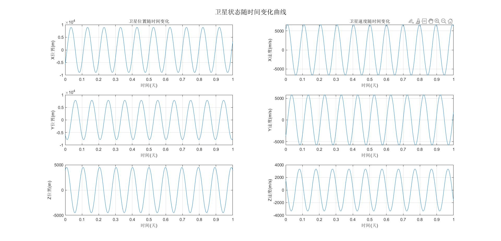

## 运行结果
先看结果：


_3D模型_

_2D_

_卫星状态信息_

## 代码
### earth.m
~~~
%% 基本数据
G = 6.67430e-11;    % 万有引力常数，单位：m^3/(kg*s^2)
M_earth = 5.972e24; % 单位：千克
M_moon = 7.348e22;  % 单位：千克
R_earth = 6371e3;   % 地球半径，单位：m（转换为米以便单位统一）

%% 绘制地球模型
Globe_3D=plot_Globe_3D;      %3d模型
Globe_2D=plot_Globe_2D;      %2d模型

% figure(Globe_3D);
% plot3(-2439e3,-3367e3,5826e3,'*');

%% 绘制卫星模型
% 卫星轨道基本信息
% 轨道六根数
initial_params = struct();
initial_params.a = 9000e3;          % 半长轴，单位为米
initial_params.e = 0.001;           % 偏心率
initial_params.i = deg2rad(30);     % 倾角，转换为弧度
initial_params.Omega = deg2rad(10); % 升交点赤经，转换为弧度
initial_params.w = deg2rad(120);    % 近地点幅角，转换为弧度
initial_params.nu = deg2rad(0);     % 真近点角，转换为弧度

initial_params.mass = 500;          % 卫星质量，单位为千克
initial_params.time = 1*86400;        % 卫星运行时间，单位为秒，1天 = 86400秒

%% 调用轨道函数
funs=orbit_functions;

% 轨道六根数转换为ECI坐标系位置、速度矢量信息
[initial_params.position,initial_params.velocity]=funs.orbital2pv(initial_params);

% 获取卫星轨道速度、位置、运行时刻信息
[initial_params.position,initial_params.velocity,initial_params.t]=funs.orbit_draw(initial_params);

% 从ECI坐标系转换为ECEF坐标系
initial_params.position_ecef = funs.eci2ecef(initial_params);

% 转经纬度
[initial_params.llh]=funs.ecef2latlon(initial_params.position_ecef);

% 打印卫星信息
disp(initial_params);

%% 绘制卫星轨道
% 3D模型
figure(Globe_3D);
plot3(initial_params.position.x, initial_params.position.y, initial_params.position.z, 'r-', 'LineWidth', 1.5);

% 绘制初始位置
plot3(initial_params.position.x(1), initial_params.position.y(1), initial_params.position.z(1), 'go', 'MarkerSize', 8, 'MarkerFaceColor', 'g');
text(initial_params.position.x(1), initial_params.position.y(1), initial_params.position.z(1), 'Initial position');
% 绘制最终位置
plot3(initial_params.position.x(end), initial_params.position.y(end), initial_params.position.z(end), 'mo', 'MarkerSize', 8, 'MarkerFaceColor', 'm');
text(initial_params.position.x(end), initial_params.position.y(end), initial_params.position.z(end), 'Final position');
% 图像标签说明
legend('Earth', 'Castle','Orbit', 'Initial position', 'Final position');

% 2D模型
figure(Globe_2D);
plot(116.3912757,39.906217,'*');    %北京坐标
text(116.3912757,39.906217,'Bei Jing','HorizontalAlignment','right');
plot(initial_params.llh.longitude,initial_params.llh.latitude,'.');
title('不准确，初步估计可能是时间问题');

%% 绘制卫星状态随时间变化曲线
figure;sgtitle('卫星状态随时间变化曲线');
subplot(3,2,1);plot(initial_params.t/86400,initial_params.position.x);grid on;xlabel('时间(天)');ylabel('X位置(m)');title('卫星位置随时间变化');
subplot(3,2,3);plot(initial_params.t/86400,initial_params.position.y);grid on;xlabel('时间(天)');ylabel('Y位置(m)');
subplot(3,2,5);plot(initial_params.t/86400,initial_params.position.z);grid on;xlabel('时间(天)');ylabel('Z位置(m)');
subplot(3,2,2);plot(initial_params.t/86400,initial_params.velocity.vx);grid on;xlabel('时间(天)');ylabel('X速度(m/s)');title('卫星速度随时间变化');
subplot(3,2,4);plot(initial_params.t/86400,initial_params.velocity.vy);grid on;xlabel('时间(天)');ylabel('Y速度(m/s)');
subplot(3,2,6);plot(initial_params.t/86400,initial_params.velocity.vz);grid on;xlabel('时间(天)');ylabel('Z速度(m/s)');
~~~

### 函数库
orbit_functions.mlx
~~~
轨道函数
function funs = orbit_functions

    % 轨道六根数转换为位置、速度矢量信息
    funs.orbital2pv = @orbital2pv;
    % 绘制卫星轨道
    funs.orbit_draw = @orbit_draw;
    % ECI转ECEF坐标系
    funs.eci2ecef=@eci2ecef;
    % 坐标系转换为经纬度坐标
    funs.ecef2latlon = @ecef2latlon;

end

orbital_to_pv
轨道六根数转换为位置、速度矢量信息
function [x,y] = orbital2pv(initial_params)
    
    % 轨道六根数转换为ECI坐标系位置、速度矢量信息
    % 输入:
    %   initial_params - 结构体，包含卫星所有信息
    % 输出:
    %   x - 结构体，包含卫星位置x, y, z字段
    %   y - 结构体，包含卫星速度vx, vy, vz字段

    %% 基本数据
    G = 6.67430e-11;    % 万有引力常数，单位：m^3/(kg*s^2)
    M_earth = 5.972e24; % 地球质量，单位：kg
    mu = G * M_earth;   % 地球引力参数，单位：m^3/s^2
    
    % 1. 计算轨道半径大小
    r = initial_params.a * (1 - initial_params.e^2) / (1 + initial_params.e * cos(initial_params.nu));
    
    % 2. 计算近焦点坐标系中的位置向量 (r_x, r_y, 0)
    r_pqw = [
        r * cos(initial_params.nu);          % x分量
        r * sin(initial_params.nu);          % y分量
        0                                   % z分量（轨道平面内）
    ];
    
    % 3. 计算近焦点坐标系中的速度向量
    v_pqw_magnitude = sqrt(mu / (initial_params.a * (1 - initial_params.e^2)));
    v_pqw = [
        -v_pqw_magnitude * sin(initial_params.nu);                      % x分量
        v_pqw_magnitude * (initial_params.e + cos(initial_params.nu));  % y分量
        0                                                               % z分量
    ];
    
    % 4. 构建坐标系转换矩阵（近焦点坐标系 -> 惯性坐标系）
    % 旋转顺序：升交点赤经 -> 倾角 -> 近地点幅角
    R3_Omega = [
        cos(initial_params.Omega),  sin(initial_params.Omega), 0;
        -sin(initial_params.Omega), cos(initial_params.Omega), 0;
        0,                          0,                         1
    ];
    
    R1_i = [
        1, 0,                   0;
        0, cos(initial_params.i), sin(initial_params.i);
        0, -sin(initial_params.i), cos(initial_params.i)
    ];
    
    R3_w = [
        cos(initial_params.w),  sin(initial_params.w), 0;
        -sin(initial_params.w), cos(initial_params.w), 0;
        0,                      0,                     1
    ];
    
    % 总转换矩阵
    M = R3_Omega * R1_i * R3_w;
    
    % 5. 转换到惯性坐标系
    initial_params.position = M * r_pqw;  % 位置向量，单位：米
    initial_params.velocity = M * v_pqw;  % 速度向量，单位：米/秒
    
    x=initial_params.position;
    y=initial_params.velocity;
end
绘制卫星轨道
function [initial_params_p,initial_params_v,initial_params_t] = orbit_draw(initial_params)
    
    % 绘制卫星轨道
    % 输入:
    %   initial_params - 结构体，包含卫星所有信息
    % 输出:
    %   initial_params_p - 结构体，包含卫星位置x, y, z字段
    %   initial_params_v - 结构体，包含卫星速度vx, vy, vz字段
    %   initial_params_t - 数组，包含卫星运行时刻信息

    % 基本数据
    G = 6.67430e-11;    % 万有引力常数，单位：m^3/(kg*s^2)
    M_earth = 5.972e24; % 地球质量，单位：kg
    
    % 状态向量：[x, y, z, vx, vy, vz]
    initial_state = [initial_params.position; initial_params.velocity];
    
    %% 时间设置
    % 模拟时间：1天 = 86400秒，这里模拟3天
    tspan = [0, initial_params.time];
    
    %% 使用ode45求解
    options = odeset('RelTol', 1e-10, 'AbsTol', 1e-10);
    [initial_params_t, state] = ode45(@(t, y) satellite_dynamics(t, y, G, M_earth), tspan, initial_state, options);
    
    %% 提取结果
    initial_params_p = struct();
    initial_params_p.x = state(:, 1) / 1e3;  % 转换为米
    initial_params_p.y = state(:, 2) / 1e3;
    initial_params_p.z = state(:, 3) / 1e3;
    initial_params_v = struct();
    initial_params_v.vx = state(:, 4);
    initial_params_v.vy = state(:, 5);
    initial_params_v.vz = state(:, 6);
    
    % 定义运动方程
    % 状态向量 y = [x, y, z, vx, vy, vz]
    function dydt = satellite_dynamics(~, y, G, M_earth)
        x = y(1);
        y_pos = y(2);
        z = y(3);
        vx = y(4);
        vy = y(5);
        vz = y(6);
        
        % 计算到地心的距离
        r = sqrt(x^2 + y_pos^2 + z^2);
        
        % 万有引力加速度 (只考虑地球引力)
        ax = -G * M_earth * x / r^3;
        ay = -G * M_earth * y_pos / r^3;
        az = -G * M_earth * z / r^3;
        
        % 一阶微分方程组
        dydt = [vx; vy; vz; ax; ay; az];
    end

end
ECI转ECEF坐标系
function ecef = eci2ecef(initial_params)
    % ECI坐标转ECEF坐标
    % 输入:
    %   initial_params - 结构体，包含卫星所有信息
    % 输出:
    %   ecef - 结构体，包含x, y, z字段，均为n行1列的ECEF坐标
    
    % 确保输入坐标为列向量
    x_eci = initial_params.position.x;
    y_eci = initial_params.position.y;
    z_eci = initial_params.position.z;
    time = initial_params.time;
    
    % 获取数据点数
    n = length(x_eci);
    
    % 计算格林尼治恒星时(GST)，单位：弧度
    gst = 2*pi*(0.7790572732640 + 1.00273781191135448*time/86400);
    gst = mod(gst, 2*pi); % 确保在0到2π之间
    
    % 构建旋转矩阵(ECI到ECEF)
    R = [cos(gst)  sin(gst)  0;
         -sin(gst) cos(gst)  0;
         0          0         1];
    
    % 初始化ECEF坐标
    x_ecef = zeros(n, 1);
    y_ecef = zeros(n, 1);
    z_ecef = zeros(n, 1);
    
    % 批量转换每个点的坐标
    for i = 1:n
        % 提取ECI坐标向量
        eci_vec = [x_eci(i); y_eci(i); z_eci(i)];
        
        % 应用旋转矩阵得到ECEF坐标
        ecef_vec = R * eci_vec;
        
        % 存储结果
        x_ecef(i) = ecef_vec(1);
        y_ecef(i) = ecef_vec(2);
        z_ecef(i) = ecef_vec(3);
    end
    
    % 构建输出结构体
    ecef = struct('x', x_ecef, 'y', y_ecef, 'z', z_ecef);
end

xyz坐标系转经纬度
function llh = ecef2latlon(ecef)
    % ECEF坐标转经纬度和高度
    % 输入:
    %   ecef - 结构体，包含x, y, z字段，均为n行1列的ECEF坐标(单位：米)
    % 输出:
    %   llh - 结构体，包含:
    %       longitude - 经度(度)，n行1列
    %       latitude  - 纬度(度)，n行1列
    %       height    - 大地高(米)，n行1列
    
    % 确保输入为列向量
    x = ecef.x(:);
    y = ecef.y(:);
    z = ecef.z(:);
    n = length(x);
    
    % WGS84椭球参数
    R = 6371008.7714;  % 常用的地球平均半径
    
    % 初始化输出
    longitude = zeros(n, 1);
    latitude = zeros(n, 1);
    height = zeros(n, 1);
    
 % 批量转换每个点
    for i = 1:n
        % 计算地心距离(球心高度)
        r = sqrt(x(i)^2 + y(i)^2 + z(i)^2);
        height(i) = r - R;  % 相对于球体表面的高度
        
        % 计算经度(弧度)
        lon_rad = atan2(y(i), x(i));
        longitude(i) = rad2deg(lon_rad);
        
        % 确保经度在[-180, 180]范围内
        if longitude(i) > 180
            longitude(i) = longitude(i) - 360;
        elseif longitude(i) < -180
            longitude(i) = longitude(i) + 360;
        end
        
        % 计算纬度(弧度) - 球体模型下简化计算
        lat_rad = asin(z(i) / r);
        latitude(i) = rad2deg(lat_rad);
    end
    
    
    % 构建输出结构体
    llh = struct('longitude', longitude, 'latitude', latitude, 'height', height);
end
~~~

## 疑问
>其实仔细观察可以发现，3D和2D图像中轨道对于地球的位置不一致，且误差不小，笔者初步估计是因为一开始时间系统设计不严谨，导致ECI坐标系转ECEF坐标系中时间、角度产生偏差，还需继续优化，如果理解不对欢迎批评、讨论。
{: .prompt-tip }