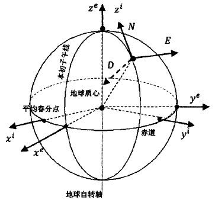
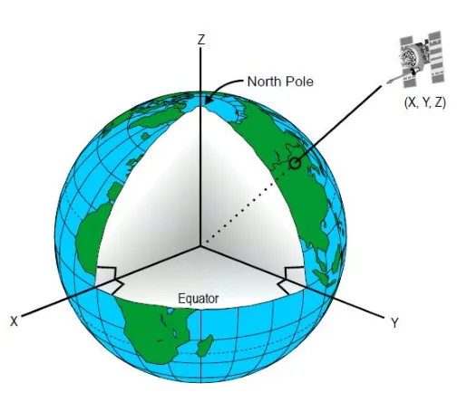

本章重点记录**坐标系**、**时间**知识点。

在之前的学习中，笔者对于坐标系、时间等基础知识重视程度不足，取得简单成果后就认为有进步。这几天的学习又增添了很多感悟，不能光学不做，这样没有进度；也不能光做不学，没有理论基础很容易埋下大雷。

之前的程序中，简单地认为地球视作球体，没有考虑过自转等问题因素。也感谢这次学习中，“多此一举”地要做3D和2D双视图，在xyz坐标转经纬度时涉及到ECI和ECEF坐标系的转变，才发现对于轨道六根数转xyz位置是什么坐标系都不清楚，立即补充学习一下，前面的文章已补充。

## 坐标系  

涉及到多种坐标系，其中 惯性坐标系（i系）、地心地固坐标系（e系）、导航坐标系 的示意图如下：

_惯性坐标系、地心坐标系_

### 1）惯性坐标系（i 系）：  
中心天体惯性系（又称为自然坐标系）以中心天体中心为原点。一般，x轴为天体赤道与黄道交线，指向春分点；z轴由中心天体中心指向北极；y轴根据右手定则确定。
下图为地心惯性系（Earth Centred Inertial (ECI) Frame）。

_地心惯性系（Earth Centred Inertial (ECI) Frame）_

惯性系的特点是牛顿第二定律在其中适用。描述物体时不需要添加惯性力。
>该坐标系不随地球自转而转动， 但是由于地球质心绕太阳公转以及太阳系绕银河系公转，因此，该系不是绝对惯性系， 然而这些影响十分微弱，低于惯导的噪声水平， 因而可以忽略不计，该系可以认为是一个惯性系。

### 2）地心地固系（e 系）：  
与大地测量中的 ECEF 系一致
理解：某一时刻，载体在e系中的坐标 在 i 系的表达，可通过方向余弦矩阵（ Direction Cosine Matrix, DCM）
实现，其表达如下：
$$
\begin{equation}
    C^i_e=
    \begin{bmatrix}
        cos(w_{ie}\Delta t)&-sin(w_{ie}\Delta t)&0\\
        sin(w_{ie}\Delta t)&cos(w_{ie}\Delta t)&0\\
        0&0&1
    \end{bmatrix}
\end{equation}
$$
> 式中$w_{ie}$表示$e$系相对于$i$系的旋转角速度，即地球自转角速度；$\Delta t$表示旋转时间间隔

## 时间  
(待更新完善)
### 世界时（Universal Time，UT）
即格林尼治平太阳时，是指格林尼治所在地的标准时间，也是表示地球自转速率的一种形式。以地球自转为基础的时间计量系统。地球自转的角度可用地方子午线相对于地球上的基本参考点的运动来度量。为了测量地球自转，人们在天球上选取了两个基本参考点：春分点（见分至点）和平太阳点，由此确定的时间分别称为恒星时和平太阳时。
### 地球自转角
地球自转角是天体测量学中用于量化地球自转运动的核心参数，被国际天文学联合会（IAU）定义为沿天球中间极对应的中间赤道逆向计量的地球中间零点（TIO）与天球中间零点（CIO）之间的角度。该参数通过精确的数学表达式与世界时UT1直接关联，其计算公式为
$$
    \begin{equation}
        ERA(UT1)=2π[0.7790572732640+1.00273781191135448×(JD\underline{ }UT1-2451545.0)]
    \end{equation}
$$
其线性特性使其避免了对岁差-章动模型的依赖。实测数据显示地球平均自转角速度约为7.2921151467×10⁻⁵弧度/秒，空间大地测量技术已实现20微秒/天的日长变化监测精度。