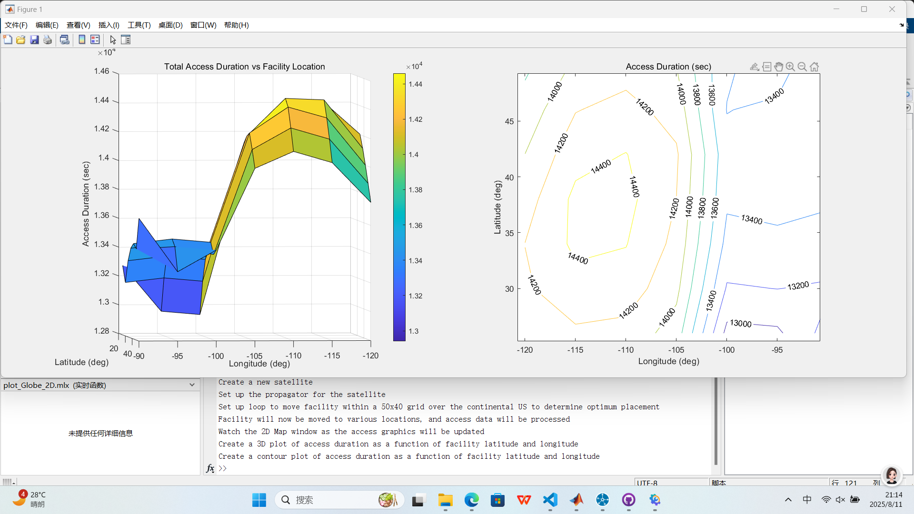
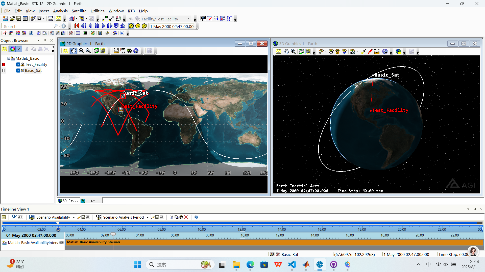

## 运行结果
先看结果：


_matlab运行结果_

_运行结果_

## 说明
前几天自己写了卫星围绕地球旋转，想起来之前将matlab互联起来了，这样用现成的工具更加精确和方便，于是尝试用matlab代码在工具中实现一些功能。

下面的代码是摘抄的基础代码，笔者对于源代码进行了学习、错误纠正（非常非常小的错误）、补充优化（非常小的补充）。

再加一句，这个方向的学习资料是真的很少。

## 代码
### duration_access.m
实现功能：在**经度：-120°~-90°  维度：26°-50°**之间的7个地面站获取卫星的Duration（重访时间）数据
~~~
%
% This MATLAB Mfile will demonstrate the creation/parsing of a report
% and the optimization of facilty placement based on access duration
%

% This is a contributed program. AGI (Analytical Graphics Inc.) assumes no responsibility
% whatsoever for the results obtained from, or any damage caused by the use of this
% program.

stkInit
% 清除matlab中打开的任何图形
delete(get(0,'children'));
%打开与STK的连接
conid=stkOpen(stkDefaultHost); 

% stkValidScen命令作用，如果stk中已经存在场景，则返回1，否则为0
scen_open = stkValidScen;
if scen_open == 1
    rtnData = questdlg('Close the current scenario?');
    % questdlg是GUI中的问题对话框命令，默认答案是‘yes’、’no’和’cancel’
    if ~strcmp(rtnData,'Yes')
        % strcmp是比较两个字符串的命令，如果相同则返回1，否则返回0
        stkClose(conid) %如果选no的话，关闭与stk的通信
        return
        else
        stkUnload('/*') %选yes的情况，卸载stk中当前存在的场景
    end
end

% 数据转化
dtr = pi/180; % degrees to radians（度转弧度）
rtd = 180/pi; % radians to degrees（弧度转度）

%% 建立一个新场景
disp('Create a new scenario');
% stk中建立一个场景的格式
% stkNewObj('parentPath', 'class', 'name')
stkNewObj('/','Scenario','Matlab_Basic');

% 设置场景周期
% stkSetTimePeriod('start', 'stop', 'dateFormat')
disp('Set scenario time period');
TimeStart = '1 May 2000 00:00:00.0'; 
TimeStop = '2 May 2000 00:00:00.0'; 
stkSetTimePeriod(TimeStart, TimeStop, 'GREGUTC'); 
stkSetEpoch('1 May 2000 00:00:00.0','GREGUTC'); % epoch（周期）
stkSyncEpoch; %同步 aeroToolbox 和 STK 场景 epoch

% stkConnect发送例行的连接命令到stk中
% rtnData = stkConnect(conID, 'command', 'objPath', 'cmdParamString')
% 设置STK场景动画历元。
rtnData = stkConnect(conid,'Animate','Scenario/Matlab_Basic','SetValues "1 May 2000 00:00:00.0" 60 0.1');
% 设置动画时间复位。
rtnData = stkConnect(conid,'Animate','Scenario/Matlab_Basic','Reset'); 

% 建立新的地面站
% stkNewObj('parentPath', 'class', 'name')
disp('Create a new facility');
stkNewObj('*/','Facility','Test_Facility');

%建立新的卫星
disp('Create a new satellite');
stkNewObj('*/','Satellite','Basic_Sat');

% set up the propagator for the satellite
disp('Set up the propagator for the satellite');
inc = 60*dtr;               % 倾角（inclination）
raan = 132.881811*dtr;      % 升交点赤经（Right Ascension of the Ascending Node）
% stkSetPropClassical设置propagator的参数（轨道六根数），在传统的坐标系中
% stkSetPropClassical('objPath', 'propagator', 'coordSystem', ...
% tStart, tStop, dt, orbitEpoch, semimajorAxis, eccentricity,...
% inclination, argOfPerigee, RAAN, meanAnomaly, coordEpoch)
% 目标路径的说明*/Satellite/Basic_Sat，*/Satellite/是类别Basic_Sat是名字
stkSetPropClassical('*/Satellite/Basic_Sat','J4Perturbation','J2000',0,86400,60,0,9059000.608735,0.0,inc,0.0,raan,0.0);

% set up loop to move facility within a 50x40 grid to determine optimum placement
disp('Set up loop to move facility within a 50x40 grid over the continental US to determine optimum placement');
disp('Facility will now be moved to various locations, and access data will be processed');
disp('Watch the 2D Map window as the access graphics will be updated');

for i = 1:7
    lat(i) = 50 - 4*(i-1);
    for j = 1:7
        long(j) = -120 + 5*(j-1);
        % 根据经纬度的变化设置了7个地面站
        stkSetFacPosLLA('Scenario/Matlab_Basic/Facility/Test_Facility', [lat(i)*pi/180; long(j)*pi/180; 0]);
        % 计算地面站和卫星的access
        reply1=stkConnect(conid,'Access','*/Facility/Test_Facility */Satellite/Basic_Sat');
        % command to return the access report over the socket into the reply2 variable
        % stkAccessAccess intervals
        % intervals = stkAccess('fromPath', 'toPath')
        intervals = stkAccess('Scenario/Matlab_Basic/Satellite/Basic_Sat','Scenario/Matlab_Basic/Facility/Test_Facility');
        % sum up the duration of each access to get the total access duration between the facility and satellite
        szInt = size(intervals,1);
        duration = zeros(szInt,1);
        for k = 1:szInt
            duration(k) = intervals(k).stop - intervals(k).start;
        end
        access_duration(i,j) = sum(duration);
   end
end

% create the 3D plot of latitude, longitude, and access duration
disp('Create a 3D plot of access duration as a function of facility latitude and longitude');
figure;
set(gcf,'outerposition', get(0,'screensize'));
subplot(1,2,1);
surf(long,lat,access_duration);
view(-25,40);
title('Total Access Duration vs Facility Location');
xlabel('Longitude (deg)');
ylabel('Latitude (deg)');
zlabel('Access Duration (sec)');
colorbar('vert');

disp('Create a contour plot of access duration as a function of facility latitude and longitude');
subplot(1,2,2);
[c,h]=contour(long,lat,access_duration);
clabel(c,h);
xlabel('Longitude (deg)');
ylabel('Latitude (deg)');
title('Access Duration (sec)');

%关闭stk连接
stkClose(conid);

% this closes any default connection
stkClose;
~~~